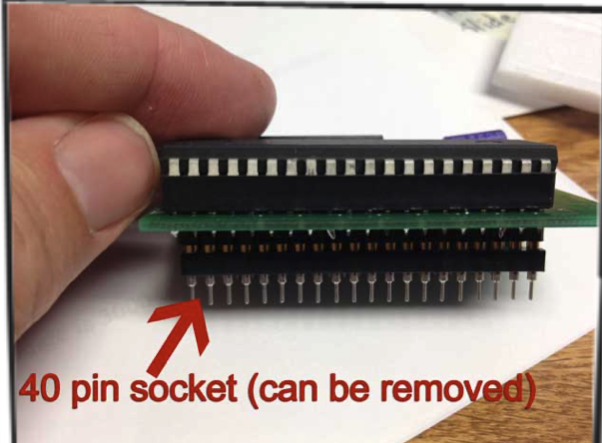
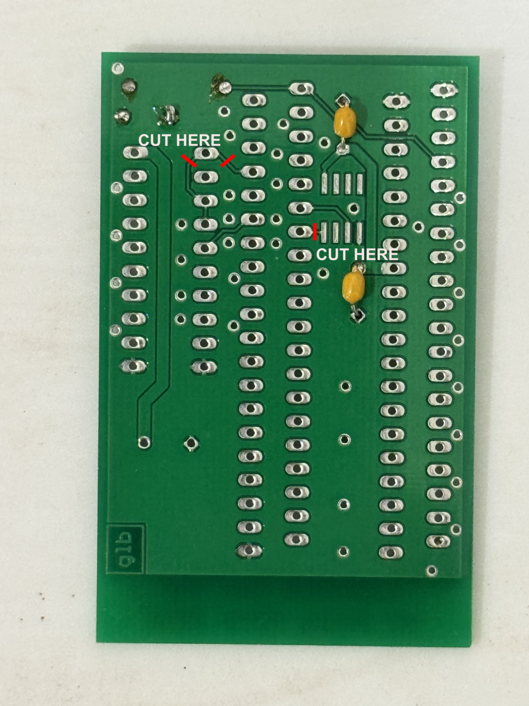
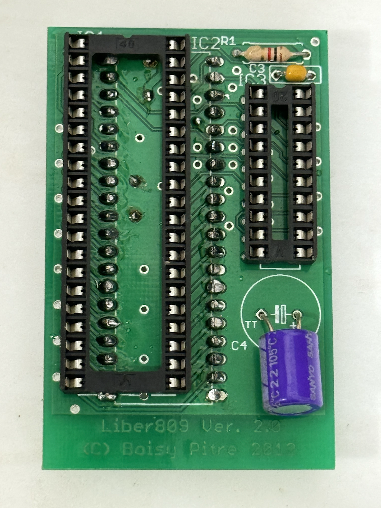
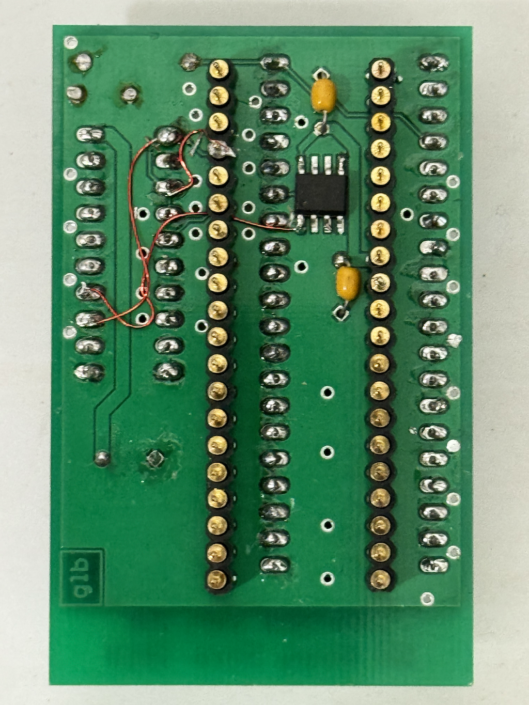
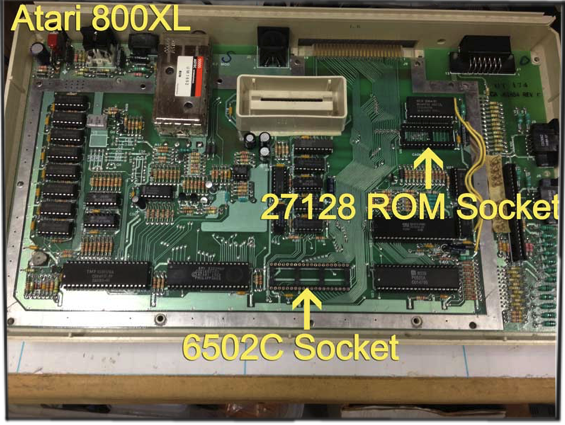
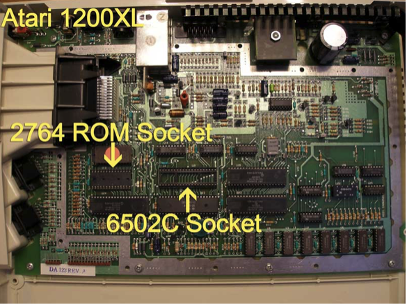
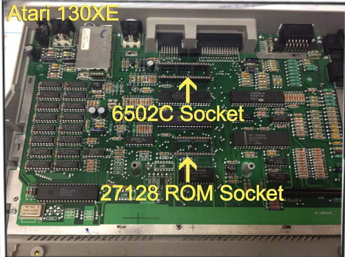

# Liber809 Installation & User Guide

## Welcome!

Liber809 is designed to mate the Motorola M6809E or Hitachi HD6309E microprocessor to 6502C-based's computers. It is a complete replacement and requires you to replace both the 6502C microprocessor and the ROM. If these two parts aren't socketed, you'll have to desolder them and install appropriate sockets.

[Click here](http://liber809.blogspot.com) to read about the development of the Liber809.

The Atari version of the Liber809 is designed to replace the 6502C microprocessor and has been verified to work on the following systems:

- Atari 65XE
- Atari 130XE
- Atari 800XL
- Atari 1200XL
- Atari XEGS

The Liber809 ROM file replaces the OS ROM found in the Atari. It resides in $F400-$FFFF of the ROM memory area and is composed of the following source files:

- **liber809.asm**: the main source file that initializes hardware, etc.
- **dwread.asm**: the DriveWire read routine for the Atari SIO.
- **dwwrite.asm**: the DriveWire write routine for the Atari SIO.
- **atari.d**: definitions file for the Atari XL/XE.

The 6809 sources are built with the `lwasm` assembler in the [LWTools](http://www.lwtools.ca) package.

The Liber809 boot ROM expects the Atari to be connected to a computer via the SIO port running a DriveWire server. Visit [the DriveWire project on GitHub](http://http://github.com/boisy/drivewire) for more information.

## Assemble the kit

If you have a Liber809 Kit, you'll need to put it together. **This requires soldering skills!** 

1. If your board is labeled "Liber809 Ver 2.0", there are three trace cuts you need to perform. Cut the two traces on the underside of the board leading to pin 1 of the GAL from either side. Also cut the trace leading from pin 34 of the 6502 to pin 1 of the DS1100. This is a very tiny trace.

2. Insert the long pin side of each of the 20 pin connectors from the bottom of the board in the two rows marked IC2. Solder the pins from the top of the board. These connectors go into the 6502 socket on your target computer.

3. Mount the 40 pin socket on the top of the board marked IC1. Solder the pins from underneath.

4. Mount the 20 pin socket on the top of the board marked IC3. Solder the pins from underneath.

5. Insert the electrolytic capacitor in the holes next to C4 on top of the board. Adhere to the polarity of the capacitor! Solder from underneath.

6. If your board is labeled "Liber809 Ver 2.0", run three bodge wires on the board. Run a bodge wire from pin 13 of the GAL to pin 1 of the GAL. Then run a bodge wire from pin 14 of the GAL to pin 1 of the DS1100. Finally, run a bodge wire from pin 3 of the GAL to pin 37 of the 6502 pin.
	
Insert the preprogrammed GAL into the 20 pin socket and the 6809 CPU into the 40 pin socket. Adhere to the pinout and insert them in the correct orientation. Then insert the 40 pin machine socket into the bottom pins. This gives you a "sacrificial" socket that you can remove in case any of the pins bend or break.

Here are the top and bottom images of a completely assembled board:

## Install the board

Installing the Liber809 on requires that both the CPU and the ROM on the motherboard be socketed.  If this is not the case, then the CPU and ROM must be desoldered and sockets put in place.  IF YOU DO NOT HAVE THE EXPERTISE TO DO THIS, THEN YOU SHOULD HAVE SOMEONE QUALIFIED TO DO THIS.

We’ve separated the installation instructions based on the type of system.  Please determine the correct installation procedures for your system and follow them carefully.

### Install on an Atari 800XL

The Atari 800XL presents a very tight fit for the Liber809.  Because of this, your Liber809 should have both the CPU and the support chip directly soldered onto the board, and you should REMOVE the 40 pin socket from the bottom of the Liber809 board.  This is necessary because there is very little vertical clearance when the top case and keyboard are attached to the bottom case.

Since removing the 40 pin socket from the bottom of the LIber809 board is required, you MUST BE CAREFUL TO NOT TO BEND THE PINS ON THE UNDERSIDE OF THE LIBER809 BOARD!  If you ever need to remove the Liber809 board for any reason, do so with care!

### Install on an Atari 1200XL

The Atari 1200XL can accommodate the Liber809 with the 40 pin socket in place, and with all components on the Liber809 board socketed 

The EPROM configuration is a bit different from the other supported systems, however.  The Atari 1200XL can accommodate two 2764 (8K) ROMs.  You only need to insert the EPROM in the “high” ROM socket, and can leave the other ROM in place.

### Install on an Atari 130XE

The Liber809 fits extremely well inside of the Atari 130XE. To install, unscrew and remove the top case, then carefully unplug the ribbon cable that connects the keyboard to the motherboard.  A metal shield is fixed atop the motherboard and must be removed in order to continue.  Using pliers, carefully twist the metal tabs around the edges of the metal shield until it can safely be removed.

BE CERTAIN TO KEEP the 40 pin socket attached to the bottom pins of the Liber809 board.  This not only protects the pins on the bottom of the Liber809 board, it also lifts the board enough to provide clearance from the surrounding case.

Remove the 6502C (SALLY) chip and the 16K ROM from their sockets, then install the Liber809 and 27128 EPROM in their place.

The metal shield cannot be reinstalled with the Liber809 installed, so simply put it aside.  

## Test the installation

Once you have completed the installation, reassemble your system them power it up.  If all goes well, you should see the Liber809 boot screen appear.  If you do not see this screen, check your connections and ensure that the board and ROM are snug.

### Boot NitrOS-9 with DriveWire

The Liber809 firmware is setup to discover and load an application file called **kick** which is served via DriveWire through the SIO port on the Atari.  This requires you to have a [SIO2PC](https://www.atarimax.com/sio2pc/documentation/index.html), which connects the Atari to the USB port of a modern computer running DriveWire.

Once the SIO2PC device is connected, download [DriveWire 4](https://github.com/qbancoffee/drivewire4). Also download both the [kick](https://github.com/boisy/liber809/blob/master/atari/nitros9/kick) file and the [NitrOS-9 bootfile](https://github.com/boisy/liber809/blob/master/atari/nitros9/nos96809l1v030209atari.dsk).

Copy both files into the same folder as DriveWire 4.

Now run DriveWire 4.  You will be prompted for type of computer (select ‘Atari’) and the serial port. Once setup is complete, load drive 0 with the NitrOS-9 disk you downloaded.

Now turn on the Atari. The Liber809 firmware mounts the **kick** file (which is actually a NitrOS-9 boot file), and NitrOS-9 proceeds to load on your Atari computer.
